# Object Oriented Design Patterns

## 1. Creational Patterns

### 1.1. Factory and Factory Method
**1.1.1. Intent** To separate the responsibility of object creation from its user

**1.1.2. Applicability** In all applications while creating an object against an interface

**1.1.3. Benefit** Helps in decoupling the application code from the service implementation

**1.1.4. Class Model**

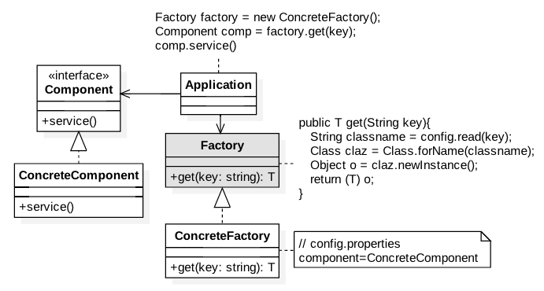

#### 1.1.5. Problem ####

***Component.java***
```
package com.glarimy.factory;

public class Component {

	public void service() {
		System.out.println("Component::service()");
	}

}
```

***Application.java***
```
package com.glarimy.factory;

public class Application {
	public static void main(String[] args) {
		Component component = new Component();
		component.service();
	}
}
```
#### 1.1.6. Solution ####

***Component.java***

```
package com.glarimy.factory;

public interface Component {
	public void service();
}
```

***ConcreteComponent.java***
```
package com.glarimy.factory;

public class ConcreteComponent implements Component {

	@Override
	public void service() {
		System.out.println("ConcreteComponent::service");
	}

}
```

***Factory.java***
```
package com.glarimy.factory;

public interface Factory<T> {
	T get(String key) throws Exception;
}
```

***ConcreteFactory.java***
```
package com.glarimy.factory;

import java.io.FileReader;
import java.util.Properties;

public class ConcreteFactory<T> implements Factory<T> {
	private Properties props;

	public ConcreteFactory() throws Exception {
		props = new Properties();
		props.load(new FileReader("config.properties"));
	}

	@Override
	@SuppressWarnings({ "rawtypes", "unchecked" })
	public T get(String key) throws Exception {
		Class claz = Class.forName(props.getProperty(key));
		return (T)claz.newInstance();
	}
}
```

***config.properties***
```
component=com.glarimy.factory.ConcreteComponent
```

***Application.java***
```
package com.glarimy.factory;

public class Application {
	public static void main(String[] args) throws Exception {
		Factory<Component> factory = new ConcreteFactory<>();
		Component component = factory.get("component");
		component.service();
	}
}
```


### 1.2. Abstract Factory
**Intent** To choose a factory from several available factories for a given interface

**Benefits** Helps in decoupling client applications from the vendor implementations

**Applicability** In cases where the API and its implementation are done by different vendors

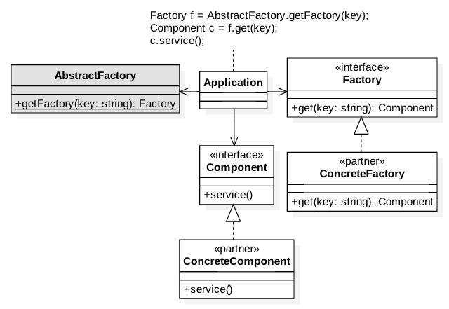

### 1.3. Singleton
**1.3.1. Intent** To limit the number of instances of a class to a maximum of one

**1.3.2. Applicability** Normally used in configuration, cache and etc., 

**1.3.3. Benefits** Helps in maintaining the application context in memory

**1.3.4. Class Model**

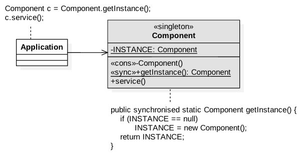

**1.3.5. Problem**

***Component.java***
```
package com.glarimy.singleton;

public class Component {
	public void service() {
		System.out.println("Component::execute");
	}

}
```

***Application.java***
```
package com.glarimy.singleton;

public class Application {
	public static void main(String[] args) throws Exception {
		Component component = new Component();
		component.service();
	}
}
```

**1.3.6. Solution**

***Component.java***
```
package com.glarimy.singleton;

public class Component {

	private static Component INSTANCE = null;

	private Component() {

	}

	public static synchronized Component getInstance() {
		if (INSTANCE == null)
			INSTANCE = new Component();
		return INSTANCE;
	}

	public void service() {
		System.out.println("Component::execute");
	}

}
```

***Application.java***
```
package com.glarimy.singleton;

public class Application {
	public static void main(String[] args) throws Exception {
		Component component = Component.getInstance();
		component.service();
	}
}
```

### 1.4. Builder
**1.4.1. Intent** To build an immutable object interactively

**1.4.2. Applicability** Often used in query builders, request builders and etc.,  

**1.4.3. Benefits** Defers creation of heavy and complex objects as much as possible

**1.4.4. Class Model**

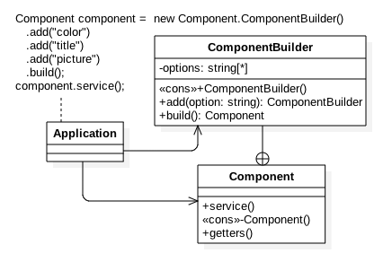

**1.4.5. Collaboration Model**

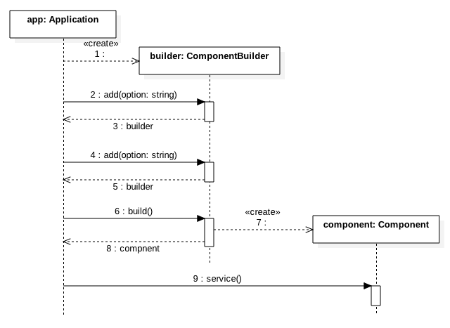

**1.4.6. Problem**

***Component.java***
```
package com.glarimy.builder;

import java.util.ArrayList;
import java.util.List;

public class Component {
	private List<String> options = new ArrayList<String>();

	public Component(String first, String second, String third) {
		this.options.add(first);
		this.options.add(second);
		this.options.add(third);
	}

	public List<String> getOptions() {
		return options;
	}

	public void setOptions(List<String> options) {
		this.options = options;
	}

	public void service() {
		System.out.println(this.options);
	}

}
```

***Application.java***
```
package com.glarimy.builder;

public class Application {
	public static void main(String[] args) throws Exception {
		Component order = new Component("color", "title", "picture");
		order.service();
	}
}
```

**1.4.7. Solution**

***Component.java***
```
package com.glarimy.builder;

import java.util.ArrayList;
import java.util.List;

public class Component {
	private List<String> options = new ArrayList<String>();

	private Component(String first, String second, String third) {
		this.options.add(first);
		this.options.add(second);
		this.options.add(third);
	}

	public String[] getOptions() {
		return (String[]) options.toArray();
	}

	public void service() {
		System.out.println(this.options);
	}
	
	public static class ComponentBuilder{
		private List<String> options = new ArrayList<String>();
		
		public ComponentBuilder add(String option) {
			options.add(option);
			return this;
		}
		
		public Component build() {
			return new Component(options.get(0), options.get(1), options.get(2));
		}
	}

}
```

***Application.java***
```
package com.glarimy.builder;

public class Application {
	public static void main(String[] args) throws Exception {
		Component component = new Component.ComponentBuilder().add("color").add("title").add("picture").build();
		component.service();
	}
}
```

## 2. Structural Patterns

### 2.1. Adapter
**2.1.1. Intent** To provide a known interface to an unknown object

**2.1.2. Applicability** Often used as a protection layer between application and third-party components 

**2.1.3. Benefits** Avoids tight coupling with third-party code

**2.1.4. Class Model**

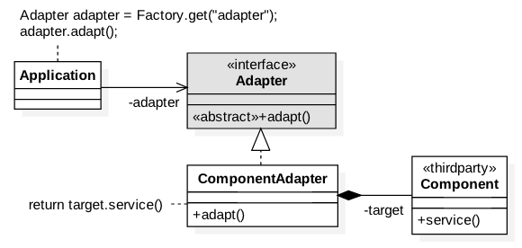

**2.1.5. Collaboration Model**

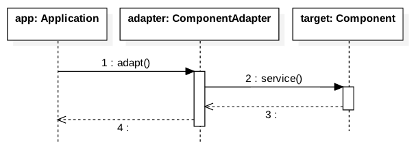

**2.1.6. Problem**

***Component.java***
```
package com.glarimy.adapter;

public class Component {

	public void service() {
		System.out.println("Component::service()");
	}

}
```

***Application.java***
```
package com.glarimy.adapter;

public class Application {
	public static void main(String[] args) {
		Component component = new Component();
		component.service();
	}
}
```

**2.1.7. Solution**

***Component.java***
```
package com.glarimy.thirdparty;

public class Component {

	public void service() {
		System.out.println("Component::service()");
	}

}
```

***Adapter.java***
```
package com.glarimy.app;

public interface Adapter {
	public void adapt();
}
```

***ConcreteAdapter.java***
```
package com.glarimy.app;

import com.glarimy.thirdparty.Component;

public class ComponentAdapter implements Adapter {
	private Component component;

	public ComponentAdapter() {
		this.component = new Component();
	}

	@Override
	public void adapt() {
		this.component.service();
	}

}
```

***Application.java***
```
package com.glarimy.app;

public class Application {
	public static void main(String[] args) {
		Adapter adapter = new ComponentAdapter();
		adapter.adapt();
	}
}
```

### 2.2. Proxy
**2.2.1. Intent** To do pre and post processing anonymously

**2.2.2. Applicability** Popular in offering pluggable quality features

**2.2.3. Benefits** Helps in separating the concerns

**2.2.4. Class Model**

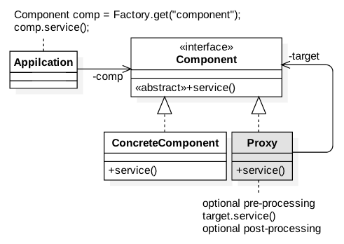

**2.2.5. Collaboration Model**

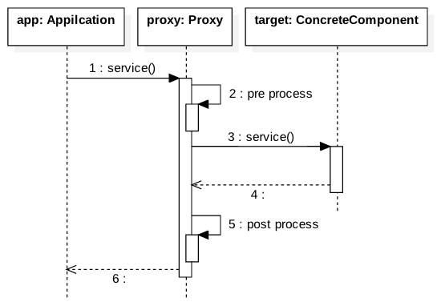

**2.2.6 Problem**

***Component.java***
```
package com.glarimy.proxy;

public class Component {

	public void service() throws Exception {
		System.out.println("Component::service");
	}

}
```

***Application.java***
```
package com.glarimy.proxy;

public class Application {
	public static void main(String[] args) throws Exception {
		Component comp = new Component();
		comp.service();
	}
}
```

**2.2.7 Solution**

***Component.java***
```
package com.glarimy.proxy;

public interface Component {

	public void service() throws Exception;

}
```

***ConcreteComponent.java***
```
package com.glarimy.proxy;

public class ConcreteComponent implements Component {

	public void service() throws Exception {
		System.out.println("ConcreteComponent::service");
	}

}
```

***Proxy.java***
```
package com.glarimy.proxy;

public class Proxy implements Component {
	private Component target;

	public Proxy(Component target) {
		this.target = target;
	}

	public void service() throws Exception {
		System.out.println("Proxy::pre processing");
		try {
			target.service();
			System.out.println("Proxy::post processing");
		}catch(Exception e) {
			System.out.println("Proxy::error handling");
			throw e;
		}
	}

}
```

***Application.java***
```
package com.glarimy.proxy;

public class Application {
	public static void main(String[] args) throws Exception {
		Component target = new ConcreteComponent();
		Component proxy = new Proxy(target);
		
		proxy.service();
	}
}
```

### 2.3. Decorator
**2.3.1. Intent** To extend an object

**2.3.2. Applicability** Often used to provide add-on features

**2.3.3. Benefits** Offloads optional functionality from objects

**2.3.4. Class Model**

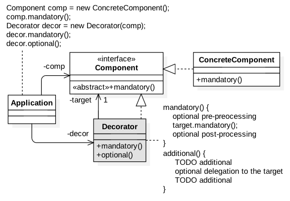

**2.3.5. Collaboration Model**

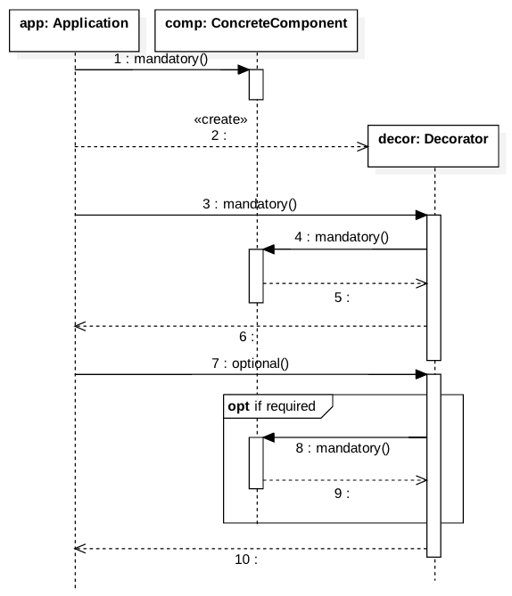

**2.3.6 Problem**

***Component.java***
```
package com.glarimy.decorator;

public class Component {
	public void mandatory() {
		System.out.println("Component::mandatory");
	}
	public void optional() {
		System.out.println("Component::optional");
	}
}
```

***Application.java***
```
package com.glarimy.decorator;

public class Application {
	public static void main(String[] args) throws Exception {
		Component comp = new Component();
		comp.mandatory();
		comp.optional();
	}
}
```

**2.3.7 Solution**

***Component.java***
```
package com.glarimy.decorator;

public interface Component {
	public void mandatory();
}
```

***ConcreteComponent.java***
```
package com.glarimy.decorator;

public class ConcreteComponent implements Component {
	@Override
	public void mandatory() {
		System.out.println("Component::mandatory");
	}
}

```

***Decorator.java***
```
package com.glarimy.decorator;

public class Decorator implements Component {
	private Component target;
	
	public Decorator(Component target) {
		this.target = target;
	}
	
	public void mandatory() {
		this.target.mandatory();
	}
	
	public void optional() {
		System.out.println("Decorator::optional pre processing");
		this.target.mandatory();
		System.out.println("Decorator::optional post processing");

	}
}
```

***Application.java***
```
package com.glarimy.decorator;

public class Application {
	public static void main(String[] args) throws Exception {
		Component comp = new ConcreteComponent();
		comp.mandatory();
		Decorator decorator = new Decorator(comp);
		decorator.mandatory();
		decorator.optional();
	}
}
```

### 2.4. Composite
**2.4.1. Intent** To treat sum of the parts as a whole

**2.4.2. Applicability** Often used in GUI widget systems  

**2.4.3. Benefits** Enables addition and removal of objects from a heirarchy without disturbance

**2.4.4. Class Model**

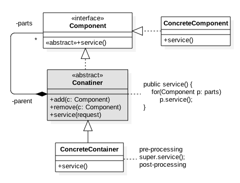

**2.4.5. Collaboration Model**

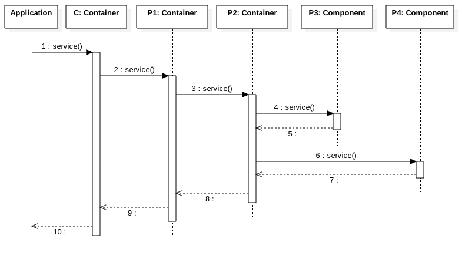

**2.4.6. Problem**

**2.4.7. Solution**

### 2.5. Facade
**2.5.1. Intent** To hide internal collaboration of objects

**2.5.2. Applicability** Often provided as a front-end gateway to a reusable system

**2.5.3. Benefits** Protects the client applications from changes in the reusable system

**2.5.4. Class Model**

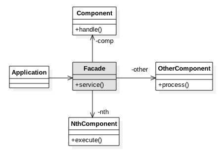

**2.5.5. Collaboration Model**

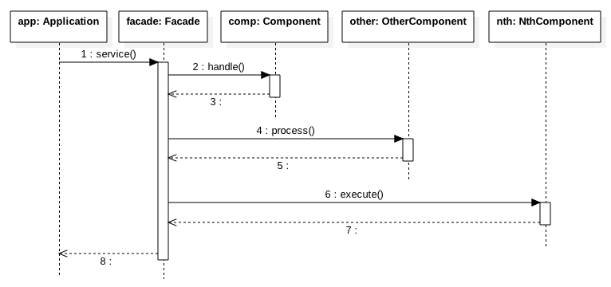

**2.5.6. Problem**

**2.5.7. Solution**

## 3. Behaviroual Patterns 

### 3.1. Chain of Responsibilities
**3.1.1. Intent** To escalate a call conditionally

**3.1.2. Applicability** Found MVC frameworks and Middleware with interceptors

**3.1.3. Benefits** Helps in plugging and plugging out interceptors without disturbing the heirarchy

**3.1.4. Class Model**

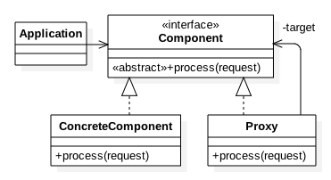

**3.1.5. Collaboration Model**

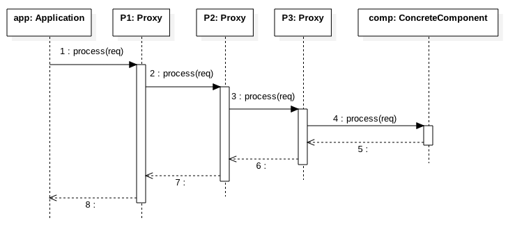

**3.1.6. Problem**

**3.1.7. Solution**

### 3.2. Mediator
**3.2.1. Intent** To enable intra-group communication asynchronously

**3.2.2. Applicability** Found in cluster management systems

**3.2.3. Benefits** Decouples the group members

**3.2.4. Class Model**

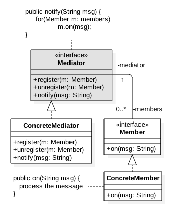

**3.2.5. Collaboration Model**

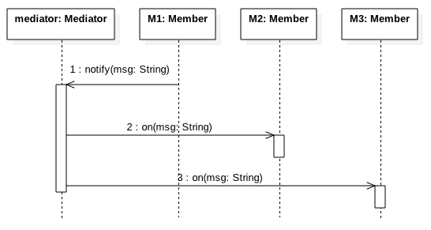

**3.2.6. Problem**

**3.2.7. Solution**

### 3.3. Observer
**3.3.1. Intent** To enable inter-group communication asynchronously

**3.3.2. Applicability** Found in messaging systems

**3.3.3. Benefits** Decouples the publishers and subscribers

**3.3.4. Class Model**

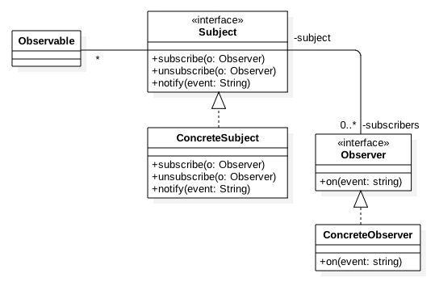

**3.3.5. Collaboration Model**

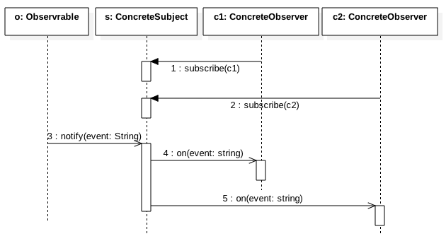

**3.3.6. Problem**

**3.3.7. Solution**

### 3.4. Strategy
**3.4.1. Intent** To choose an algorithm at runtime

**3.4.2. Applicability** Often used to offer customizable solutions

**3.4.3. Benefits** Helps in picking context specific implementation

**3.4.4. Class Model**


**3.4.5. Collaboration Model**


**3.4.6. Problem**

**3.4.7. Solution**

### 3.5. Template Method
**3.5.1. Intent** To build a generic algorithm

**3.5.2. Applicability** Often used when different algorithms share some common steps

**3.5.3. Benefits** Avoids code duplication

**3.5.4. Class Model**

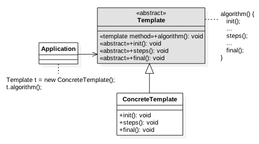

**3.5.5. Collaboration Model**

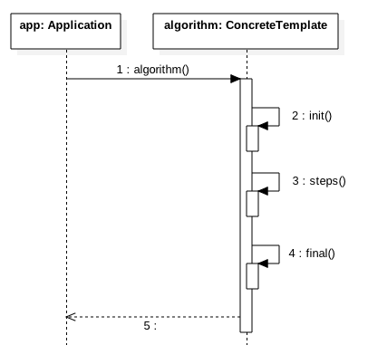

**3.5.6. Problem**

**3.5.7. Solution**

### 3.6. Iterator
**3.6.1. Intent** To travers through an datastructure without knowing the structure

**3.6.2. Applicability** Often used lists, collections, trees, graphs and etc., 

**3.6.3. Benefits** Provides unified way to iterate through a collection of elements

**3.6.4. Class Model**

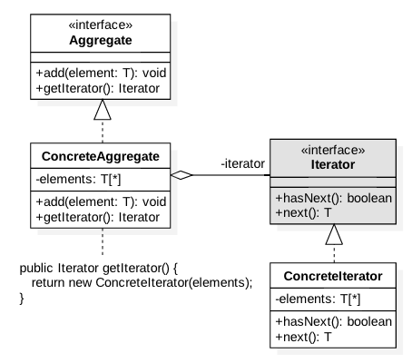

**3.6.5. Collaboration Model**

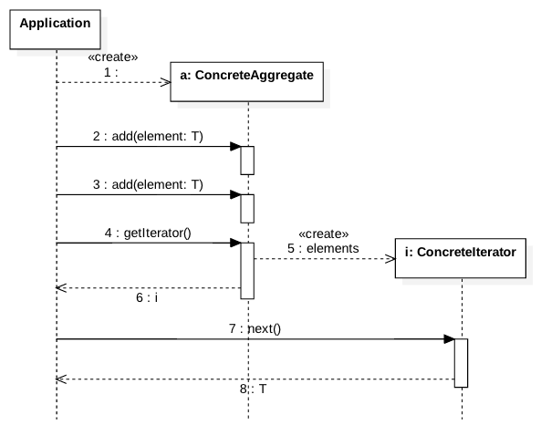

**3.6.6. Problem**

**3.6.7. Solution**

### 3.7. Visitor
**3.7.1. Intent** To decorate an object graph

**3.7.2. Applicability** Helps in offering new features without disturbing the interface

**3.7.3. Benefits** Easy to add additional functionality

**3.7.4. Class Model**

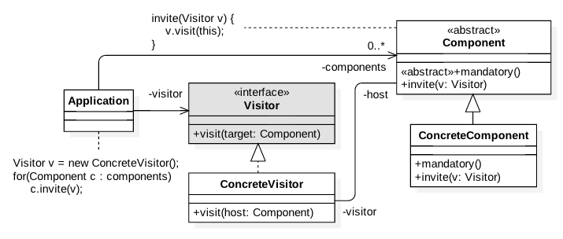

**3.7.5. Collaboration Model**

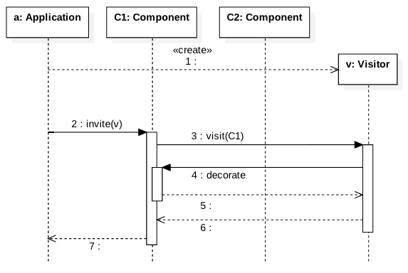

**3.7.6. Problem**

**3.7.7. Solution**

### 3.8. State
**3.8.1. Intent** To build state machine

**3.8.2. Applicability** Obvious

**3.8.3. Benefits** Helps in adding and removing states easily

**3.8.4. Class Model**


**3.8.5. Collaboration Model**


**3.8.6. Problem**

**3.8.7. Solution**

### 3.9. Command
**3.9.1. Intent** To act as a callback object

**3.9.2. Applicability** Used in event driven systems

**3.9.3. Benefits** Helps in non-blocking asynchronous systems

**3.9.4. Class Model**

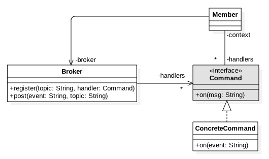

**3.9.5. Collaboration Model**

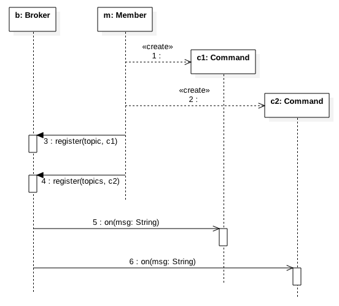

**3.9.6. Problem**

**3.9.7. Solution**


