# UML 2.0 #

## Structural Diagrams ##

### Class Diagram ###

#### Class ####

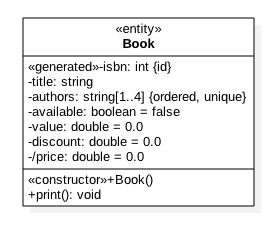

#### Association ####

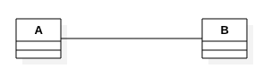

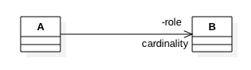

#### Aggregation ####

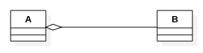

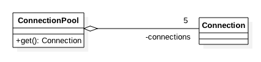

#### Composition ####

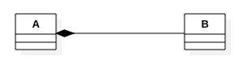

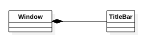

#### Dependency ####

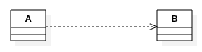

#### Association Class ####

#### Generalization ####

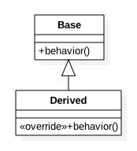

#### Interface ####

#### Realization ####

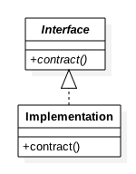

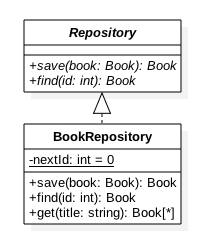

#### Class Diagram Illustration ####

### Package Diagram ###

#### Package ####
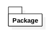

#### Package Relations ####
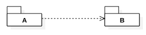

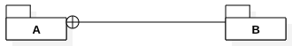

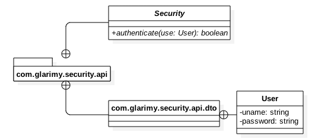

#### Package Diagram Illustration ####
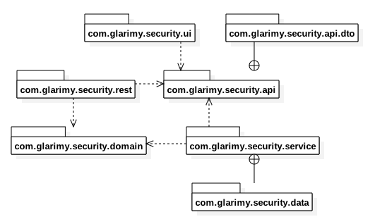

### Component Diagram ###

#### Component ####
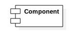

#### Component Relations ####
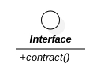

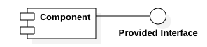

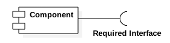

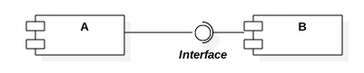

#### Component Diagram Illustration ####
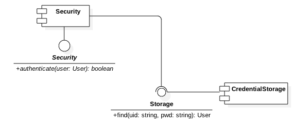

## Behavioral Diagrams ##

### Usecase Diagram ###

#### Subject ####
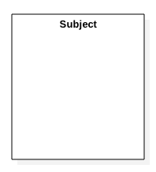

#### Usecase ####
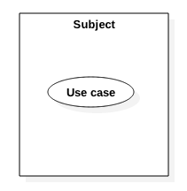

#### Actor ####
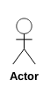

#### Association ####
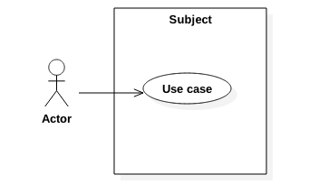

#### Extending Usecase ####
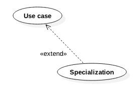

#### Extending Actor ####
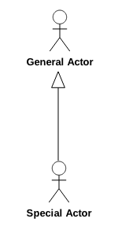

#### Including Usecase ####
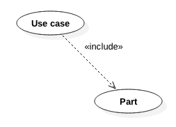

#### Usecase Diagram Illustration ####
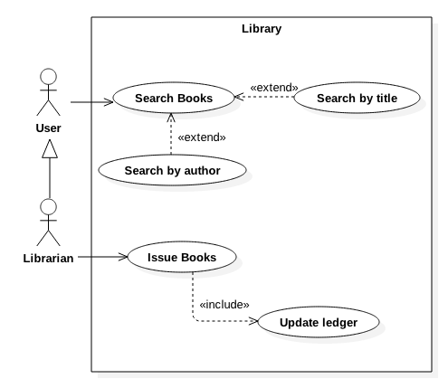
