# UML 2.0 #

## Structural Diagrams ##

### Class Diagram ###

#### Class ####

#### Association ####

#### Aggregation ####

#### Composition ####

#### Dependency ####

#### Association Class ####

#### Generalization ####

#### Interface ####

#### Realization ####

#### Class Diagram Illustration ####

### Package Diagram ###

#### Package ####

#### Package Relations ####

#### Package Diagram Illustration ####

### Component Diagram ###

#### Component ####

#### Component Relations ####

#### Component Diagram Illustration ####

### Deployment Diagram ###

#### Node ####
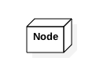

#### Node Relations ####
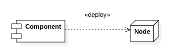

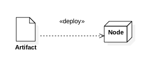

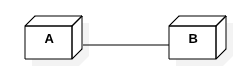

#### Deployment Diagram Illustration ####
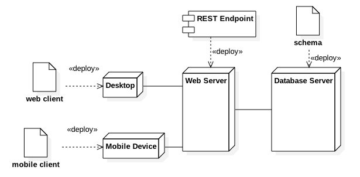

## Behavioral Diagrams ##

### Usecase Diagram ###

#### Subject ####

#### Usecase ####

#### Actor ####

#### Association ####

#### Extending Usecase ####

#### Extending Actor ####

#### Including Usecase ####

#### Usecase Diagram Illustration ####

### Activity Diagram ###

#### Action ####
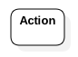

#### Activity Flows ####
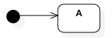

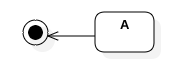

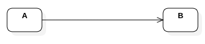

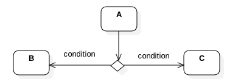

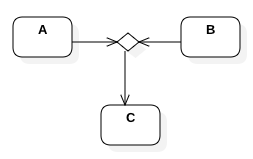

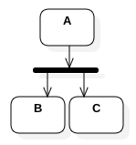

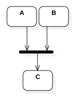

#### Activity Partitions ####

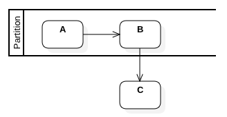

#### Activity Exceptions ####

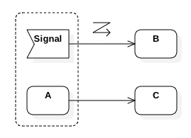

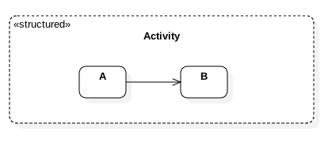

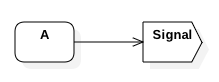

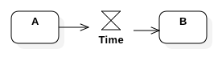

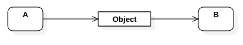

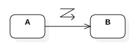

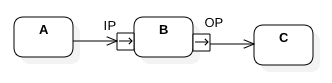

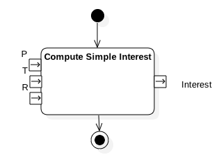

#### Activity Illustrations ####

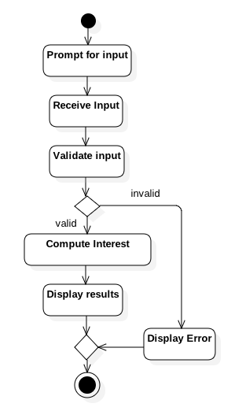

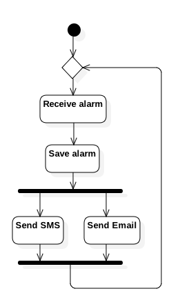

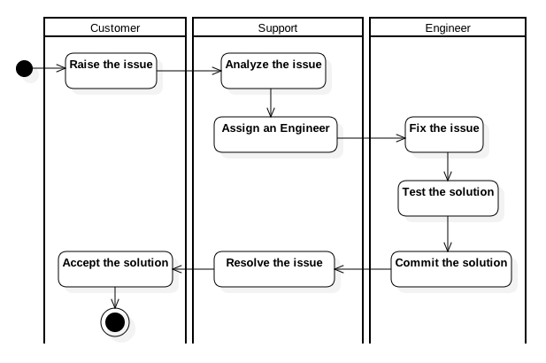

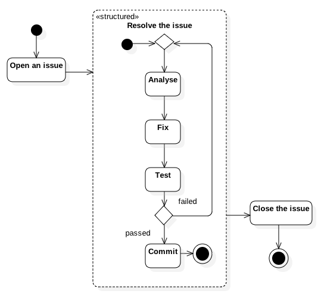

### State Chart Diagram ###

#### State ####

#### State Transitions ####

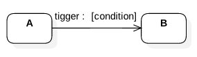

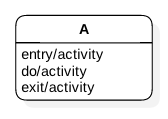

#### Kinds of States ####

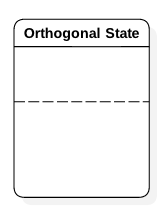

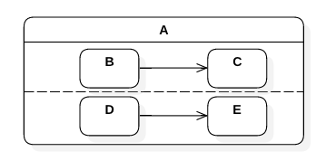

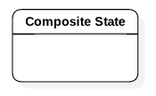

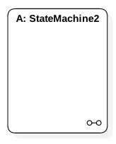

### Sequence Diagram ###

#### Lifeline ####
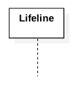

#### Interactions ####
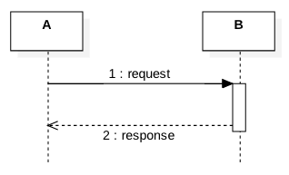

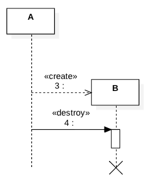

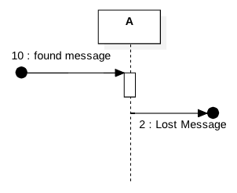

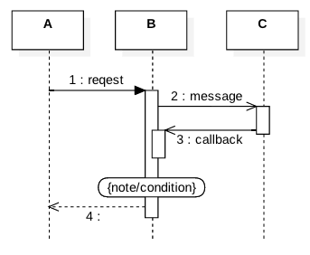

#### Fragments ####
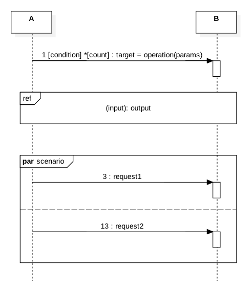