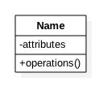
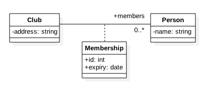
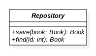
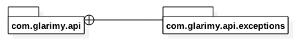
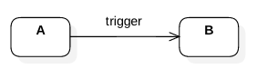
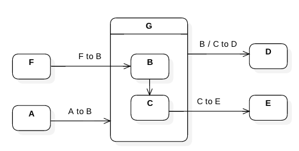

# UML 2.0 #

## Structural Diagrams ##

### Class Diagram ###

Class diagram presents the classes of the objects and their relationships.

#### Class ####
Consists of three compartments: Name, State and Behavior



State is a set of attributes and behavior is a set of operations


#### Association ####

Association represents "uses and leaves" relationship. 


Can be bi-directional as well.


Objects in a relation play a role and the cardinality can be one-to-one, one-to-many and etc., 


An illustration:

```
class Security {
    private CredentialStore store;
    ....
}
```


#### Aggregation ####

Represents "owns and share" relationship.


Illustration: A connection pool is manages 5 connections for its clients. 

```
class ConnectionPool {
    private Connection[5] connections;
    ...
}
```


#### Composition ####

Represents "part-of" relationship. The part is destroyed along with the whole. 


Illustration: The TitleBar is part of a Window


#### Dependency ####

Represents "uses and throws" relationship. 


#### Association Class ####

Represents the details of an association.



#### Generalization ####

Represents "is-a" relation. The derived object "is-a" special kind of base object.


#### Interface ####

Represents service contract. 


Illustration



#### Realization ####

Represents implementation of a contract. 


Illustration: 


#### Class Diagram Illustration ####


### Package Diagram ###

#### Package ####


#### Package Relations ####





#### Package Diagram Illustration ####


### Component Diagram ###

#### Component ####


#### Component Relations ####


#### Component Diagram Illustration ####


### Deployment Diagram ###

#### Node ####


#### Node Relations ####


#### Deployment Diagram Illustration ####


## Behavioral Diagrams ##

### Usecase Diagram ###

#### Subject ####


#### Usecase ####


#### Actor ####


#### Association ####


#### Extending Usecase ####


#### Extending Actor ####


#### Including Usecase ####


#### Usecase Diagram Illustration ####


### Activity Diagram ###

#### Action ####


#### Activity Flows ####


#### Activity Partitions ####


#### Activity Exceptions ####


#### Activity Illustrations ####


### State Chart Diagram ###

#### State ####


#### State Transitions ####





#### Kinds of States ####





### Sequence Diagram ###

#### Lifeline ####


#### Interactions ####


#### Fragments ####
