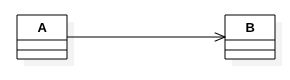
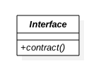

# UML 2.0 #

## Structural Diagrams ##

### Class Diagram ###

#### Class ####

#### Association ####

#### Aggregation ####

#### Composition ####

#### Dependency ####

#### Association Class ####

#### Generalization ####

#### Interface ####

#### Realization ####

#### Class Diagram Illustration ####

### Package Diagram ###

#### Package ####

#### Package Relations ####

#### Package Diagram Illustration ####

### Component Diagram ###

#### Component ####

#### Component Relations ####

#### Component Diagram Illustration ####

## Behavioral Diagrams ##

### Usecase Diagram ###

#### Subject ####

#### Usecase ####

#### Actor ####

#### Association ####

#### Extending Usecase ####

#### Extending Actor ####

#### Including Usecase ####

#### Usecase Diagram Illustration ####

