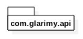

# UML 2.0 #

## 1. Structural Diagrams ##
Presents structural aspects of a system.

### 1.1. Class Diagram ###

Class diagram presents the classes of the objects and their relationships.

#### 1.1.1. Class ####
Consists of three compartments: Name, State and Behavior.


State is a set of attributes and behavior is a set of operations.


#### 1.1.2. Association ####

Association represents "uses and leaves" relationship. 


Can be bi-directional as well.


Objects in a relation play a role and the cardinality can be one-to-one, one-to-many and etc., 


An illustration:

```
class Security {
    private CredentialStore store;
    ....
}
```


#### 1.1.3. Aggregation ####

Represents "owns and share" relationship.


Illustration: A connection pool is manages 5 connections for its clients. 

```
class ConnectionPool {
    private Connection[5] connections;
    ...
}
```


#### 1.1.4. Composition ####

Represents "part-of" relationship. The part is destroyed along with the whole. 


Illustration: The TitleBar is part of a Window.


#### 1.1.5. Dependency ####

Represents "uses and throws" relationship. 


#### 1.1.6. Association Class ####

Represents the details of an association.


#### 1.1.7. Generalization ####

Represents "is-a" relation. The derived object "is-a" special kind of base object.


#### 1.1.8. Interface ####

Represents service contract. 


Illustration:


#### 1.1.9. Realization ####

Represents implementation of a contract. 


Illustration: 


#### 1.1.10. Class Diagram Illustration ####


### 1.2. Package Diagram ###
Represents logical grouping of classes.

#### 1.2.1. Package ####
A package consists of classes and sub-packages that are logically close to each other.


Various languages implement a pacakge as a modules, a namespaces and etc.,



#### 1.2.2. Package Relations ####
A package may import/depend on other package.


Illustration: 

```
package com.glarimy.client;

import com.glarimy.api;
....

```


A package may include another package.


Illustration: 
```
    namespace com.glarimy.api {
        namespace exceptions {
            ...
        }
        ...
    }
```


#### 1.2.3. Package Diagram Illustration ####

Illustration-1: 


Illustration-2:


### 1.3. Component Diagram ###

Represents functional grouping of classes.

#### 1.3.1. Component ####

A cohessive modular unit of functionality.


#### 1.3.2. Component Relations ####

A component is always associated with one or more interfaces.


A component provides an interface.


A component requires an interface.


Two components are coupled through an interface.


#### 1.3.3. Component Diagram Illustration ####


### 1.4. Deployment Diagram ###
Represents association between logical artifacts and physical devices.

#### 1.4.1. Node ####

A physical machine, device, environment and etc., 


#### 1.4.2. Node Relations ####

A component might be deployed on to a node.


An artifact like configuration file and etc., might be deploed on to a node.


Two nodes might be connected physically via network and etc., 


#### 1.4.3. Deployment Diagram Illustration ####


## 2. Behavioral Diagrams ##
Presents the dynamic aspects of a system.

### 2.1. Usecase Diagram ###
Represents the system from an external perspective.

#### 2.1.1. Subject ####
The system or a module which is being presented from an external perspective .


#### 2.1.2. Usecase ####

The feature/functionality of the subject as seen from outside of the subject.


#### 2.1.3. Actor ####

The role of external users of the subject.


#### 2.1.4. Association ####

An actor always associates with one or more usecases. Similarly, a usecause is always assoiated with one more actors. 


#### 2.1.5. Extending Usecase ####

A usecase might have a specialized behavior under certian conditions.


#### 2.1.6. Extending Actor ####

An actor may extend the previleges of another actor.


#### 2.1.7. Including Usecase ####

A usecase might have another usecase as a part of it.


#### 2.1.8. Usecase Diagram Illustration ####


### 2.2. Activity Diagram ###
Represents a workflow in the system.

#### 2.2.1. Action ####
A workflow/activity is a set of actions arranged in a logical order.


#### 2.2.2. Activity Flows ####

Every activity starts from an "initial action".


Every activity ends with a "terminal action".


Usually, the control of an activity is passed from one action to another action.


Sometimes, the control of an activity is passed to the actions based on conditions.


Often, several action paths might merge at a common point also.


Also, the control of an activity might be passed to multiple actions in parallel.


Similarly, several action paths join together before passing the control to the next action.


#### 2.2.3. Activity Partitions ####

Several actions might be grouped together for better readability.


#### 2.2.4. Special Actions ####

An action might be part of an interruptable region.


An action can be very complex which demands further granularity.


An action might be asynchronous as well.


Sometimes, delay/wait/etc., might also needs to be represented.


It is also possible to show an object flow between actions.


Exception handlers are special actions.


As an alternative to object flows, input/output pins are also used.


Illustration of pins:


#### 2.2.5. Activity Illustrations ####

Illustration-1:


Illustration-2:


Illustration-3:


Illustration-4:


### 2.3. State Chart Diagram ###
Represents the system as a state machine.

#### 2.3.1. State ####
A snapshot of the system at a given time.


#### 2.3.2. State Transitions ####

Every state machine have an initial state.


Every state machine have a terminal state.


System moves from one state to another state up on a trigger/event/etc., 


The triggered transition may happen only if a pre-condition is satisfied.


Each system may take certain actions upon entering a state, while in the given state and while leaving the state.


#### 2.3.3. Kinds of States ####

A composite state is a super state of several sub states.


Illustration: Composite State


Transition to a compisite state always invokes the first sub state unless specified. A history vertex enables transition to the last active state, instead.


A substatemachine is a re-usable unit like procedure.


An orthogonal state is a composite state with parallel transitions.


Illustration: Orthogonal state


### 2.4. Sequence Diagram ###
Represents interactions among objects in a specific scenario.

#### 2.4.1. Lifeline ####
Represents an active object


#### 2.4.2. Interactions ####
Objects make requests and receive responses from other objects.


Objects also create or destroy other objects.


An object may act up on a signal or send a signal.


Objects may post messages to other objects or invoke call backs. A state-invariant node may annotate a lifefline.


#### 2.4.3. Fragments ####

A request may be representated as a parameterized operation with optional assignments, conditions and iterations.

Several messages might be grouped together for clarity.

Interactions like opt (if), alt(if-else), parallel, critical, iter and etc., are also represented as combined fragments.

