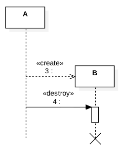
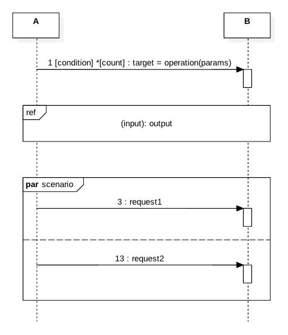

### 2.4. Sequence Diagram ###
Represents interactions among objects in a specific scenario.

#### 2.4.1. Lifeline ####
Represents an active object

#### 2.4.2. Interactions ####
Objects make requests and receive responses from other objects.

Objects also create or destroy other objects.

An object may act up on a signal or send a signal.

Objects may post messages to other objects or invoke call backs. A state-invariant node may annotate a lifefline.

#### 2.4.3. Fragments ####

A request may be representated as a parameterized operation with optional assignments, conditions and iterations.

Several messages might be grouped together for clarity.

Interactions like opt (if), alt(if-else), parallel, critical, iter and etc., are also represented as combined fragments.

